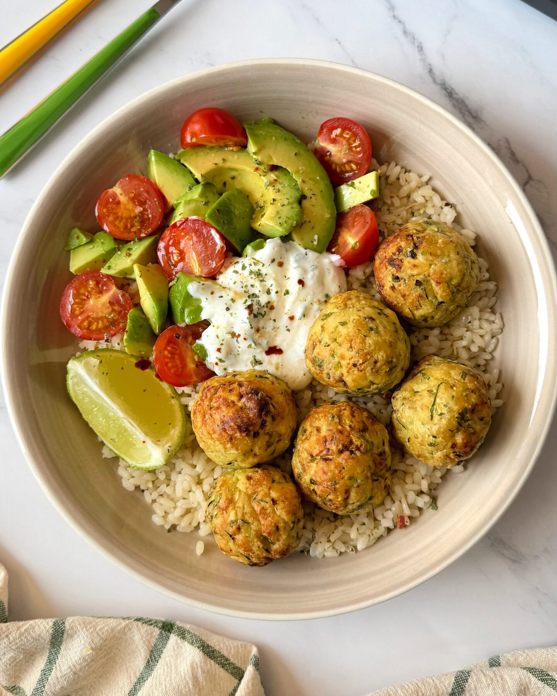

# Albóndigas de pollo y calabacín

    

## Datos básicos

* Comensales: 4
* Tiempo total de preparación: 1 hora 30 minutos

## Ingredientes

* 1Kg de carne picada de pollo
* 1 calabacín rallado (no es necesario escurrirlo)
* 1/2 taza de queso parmesano rallado
* 1/2 taza de pan rallado
* 2 yogures griegos naturales
* 200 gramos de arroz
* Perejil
* 1 huevo
* Aceite de oliva
* Sal y pimienta
* Zumo de 1 limón
* Ajo granulado

## Preparación

* Añadir a un bol
    * La carne de pollo
    * El calabacín rallado
    * El perejil
    * El queso parmesano
    * El huevo
    * El pan rallado
    * Sal y pimienta (añadir otras especias al gusto)
* Mezclar hasta obtener una masa homogénea. Formar entonces albóndigas
* Hornear a 190ºC sobre papel vegetal, unos 8-10 minutos por lado (dar la vuelta cuando estén doradas de un lado)
* Hervir el arroz unos 20 minutos mientras se hacen las albóndigas
* Preparar la salsa: mezclar el yogur griego con el zumo de limón, 2 cucharadas de aceite de oliva, ajo en polvo, sal y pimienta al gusto
* Emplatar las albóndigas junto con el arroz y 1-2 cucharadas de salsa
* Se pueden añadir otros elementos, como tomates cherry o aguacate, al gusto.
