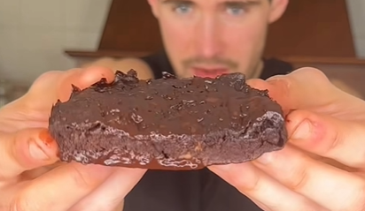
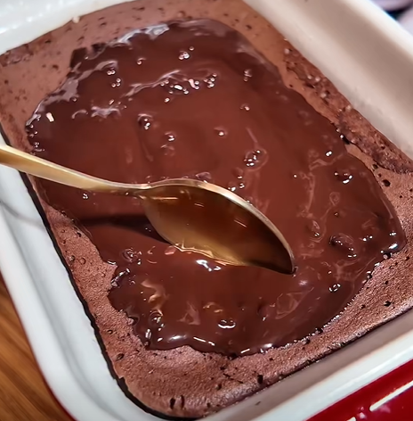

# Bizcocho de chocolate saludable

## Versión 1

    

### Datos básicos

* Comensales: 2
* Tiempo total de preparación: 10 minutos
* [Receta en Facebook](https://www.facebook.com/reel/1075385311530013) (segunda parte del vídeo)

### Ingredientes

* 1 plátano
* 2 huevos
* 2-3 cucharaditas de postre de cacao puro en polvo
* 1/2 cucharadita de postre de levadura
* 1 onza de chocolate puro
* 1 puñadito de nueces troceadas o picadas

### Preparación

1. En un bol aplastar bien el plátano. Añadir los huevos, el cacao y la levadura, y mezclar todo bien
2. Llevar al microondas a máxima potencia 3-5 minutos
3. Sacar caliente y restregar la onza de chocolate por encima para que se vaya derritiendo en la superficie
4. Espolvorear las nueces picadas

## Versión 2

    

### Datos básicos

* Comensales: 4
* Tiempo total de preparación: 30 minutos
* [Receta en Facebook](https://www.facebook.com/reel/2468486090338905)

### Ingredientes

* 100 g de queso cottage
* 1 cucharada de cacao puro
* 1 huevo
* 1 chorrito de endulzante (opcional)
* Chocolate puro en cachitos

### Preparación

1. En un bol mezclar el queso, el cacao, el huevo y el endulzante
2. Llevar a un molde para horno y echar el chocolate en cachitos por encima
3. Hornear 20 o 30 minutos a 180º

## Versión 3

    

### Datos básicos

* Comensales: 4
* Tiempo total de preparación: 30 minutos
* [Receta en Facebook](https://www.facebook.com/reel/2189113868686779)

### Ingredientes

* 1 plátano
* 2 huevos
* 2 cucharadas de cacao en polvo
* 1 onza de chocolate puro

### Preparación

1. Batir el plátano con los huevos y el cacao en polvo
2. Llevar a un molde para microondas y calentar 3 minutos
3. Pasar la onza de chocolate por encima con el bizcocho caliente, para que se derrita en la superficie
