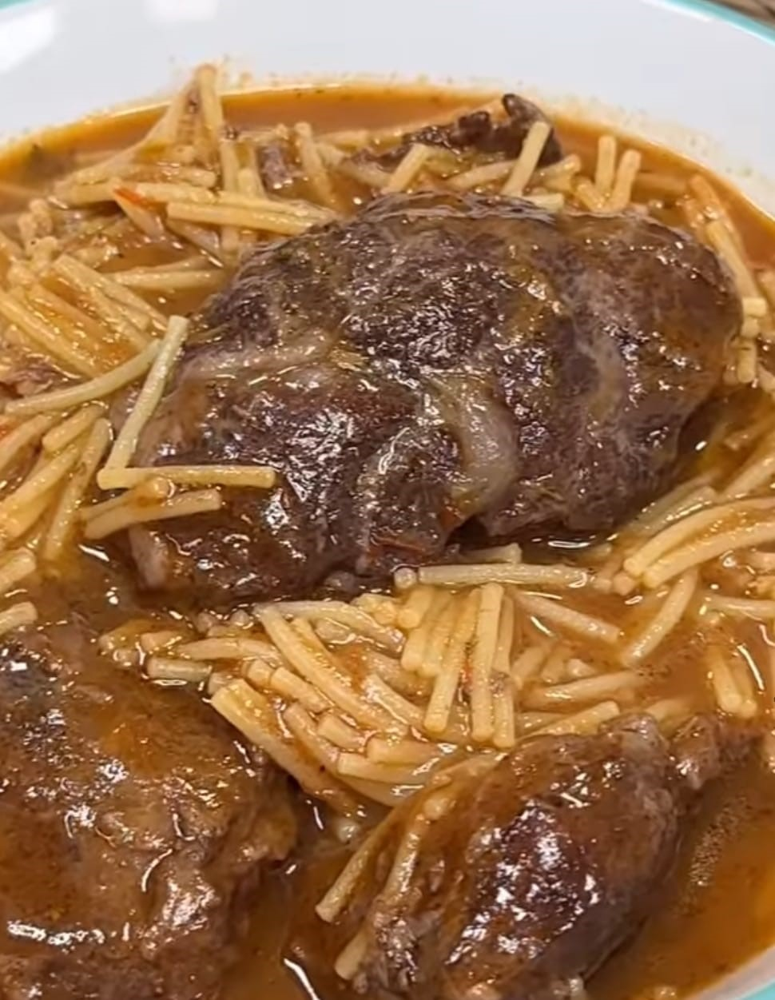

# Cazuela de fideos con carrilleras

    

## Datos básicos

* Comensales: 4
* Tiempo total de preparación: 3 horas

## Ingredientes

* 8 carrilleras de cerdo
* 1 cebolla
* 1 pimiento verde
* 1 pimiento rojo
* 3 dientes de ajo
* 1 bote de tomate entero pelado
* 1 litro de caldo de carne o pollo
* 250 gramos de fideos gruesos
* 1 cucharada de orégano
* 1 cucharada de romero
* 1 chorro de vinagre de módena
* Sal y pimienta
* Aceite de oliva

## Preparación

1. Echar las carrilleras en una olla con aceite, añadir sal y pimienta y dorar hasta que estén selladas. Reservar
2. En la misma olla con el mismo aceite, freír la cebolla y los pimientos cortados, con un poco sal. Cocinamos 10 minutos a un fuego de 6 sobre 9.
3. Incorporar 5 tomates enteros pelados, machacarlos un poco y añadir el orégano y el romero. Remover y dejar un par de minutos
4. Cubrir con parte del caldo de pollo/carne y el chorro de vinagre. Dejar unos minutos hasta que rompa a hervir
5. Añadir las carrilleras reservadas, cubrir con el resto del caldo y algo de agua si es necesario. Cocinar a un fuego de 5 o 6 sobre 9 durante 2 horas, con la tapa puesta.
6. Sacar las carilleras y triturar el caldo
7. Cuando rompa a hervir de nuevo, incorporar los fideos y las carrilleras (2 por persona), y dejar hervir el tiempo que se recomiende para los fideos