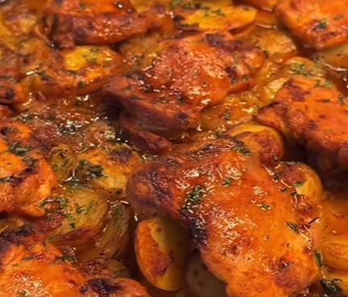

# Contramuslos de pollo al horno con patatas

    

## Datos básicos

* Comensales: 4
* Tiempo total de preparación: 1 hora
* [Enlace a receta en Facebook](https://www.facebook.com/reel/1285787250210007)

## Ingredientes

* 800 g de contramuslos deshuesados y sin piel
* 6 o 7 patatas medianas peladas y cortadas en rodajas gruesas
* 2 cebollas medianas cortadas en rodajas
* 1 cucharada de tomate concentrado
* 1 taza pequeña de leche (100 ml aprox)
* Aceite de oliva
* Sal
* Especias al gusto: pimentón, pimienta, orégano

## Preparación

1. En una bandeja de horno colocar las patatas y las cebollas. Agregar aceite, sal y las especias que queramos. Mezclar bien y extender formando una capa
2. Colocar el pollo encima
3. En un bol aparte, mezclar el tomate concentrado, media taza de aceite, la leche y las especias que queramos. Remover hasta que esté todo integrado y el tomate bien disuelto
4. Verter la salsa sobre el pollo de forma uniforme, y llevar al horno precalentado a 190ºC. Hornear hasta que esté el pollo dorado por fuera, unos 45-50 minutos.
