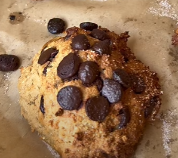
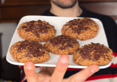

# Cookies con pepitas de chocolate

## Versión 1

    

### Datos básicos

* Comensales: 4
* Tiempo total de preparación: 15 minutos
* [Receta en Facebook](https://www.facebook.com/reel/1059421483351493)

### Ingredientes

* 200 g de harina de avena
* 2 cucharadas de yogur griego
* 1 cucharadita de levadura
* 1 chorrito de endulzante
* Chips de chocolate sin azúcar o chocolate 85% cacao troceado

### Preparación

1. Mezclar la harina de avena con el yogur, la levadura y el endulzante hasta obtener una masa. 
2. Echar luego las pepitas y mezclar
3. Formar bolas, aplastarlas y ponerlas en una bandeja de horno. Añadir algunas pepitas más por encima
4. Hornear a 180º unos 10-12 minutos, o hasta que se dore

## Versión 2

    

### Datos básicos

* Comensales: 4
* Tiempo total de preparación: 15 minutos
* [Receta en Facebook](https://www.facebook.com/reel/1389100413335200)

### Ingredientes

* 100 g de harina de avena
* 120 g de plátano
* 1 huevo
* 30 g de chocolate 70%

### Preparación

1. Triturar el plátano y mezclar con el huevo y la avena
2. Añadir el chocolate troceado y formar cookies. Se puede añadir algo más de chocolate por encima
3. Hornear a 180º unos 15 minutos, o hasta que se dore
