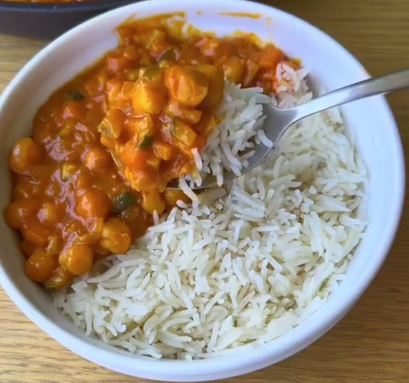

# Curry de garbanzos

    

## Datos básicos

* Comensales: 4
* Tiempo total de preparación: 30 minutos

## Ingredientes

* 2 botes de garbanzos cocidos (800 gramos en total)
* 1 cebolla
* 2 zanahorias
* 1 calabacín
* 2 cucharadas de tomate concentrado
* 1 cucharada de curry en polvo
* 400g de leche de coco
* 200g de arroz vaporizado (opcional)
* Aceite de oliva

## Preparación

1. Picar la cebolla, calabacín y zanahorias muy pequeñas y sofreír con aceite
2. Opcionalmente, poner a cocer el arroz en una olla 20 minutos, con una pastilla de caldo de pollo
3. Pasados 10 minutos, añadimos el tomate concentrado, el curry y la leche de coco, y removemos bien
4. Incorporamos los garbanzos escurridos, y dejamos reducir a fuego medio 5 minutos más
5. Servimos junto al arroz