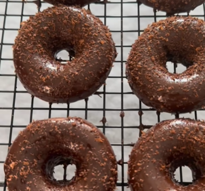
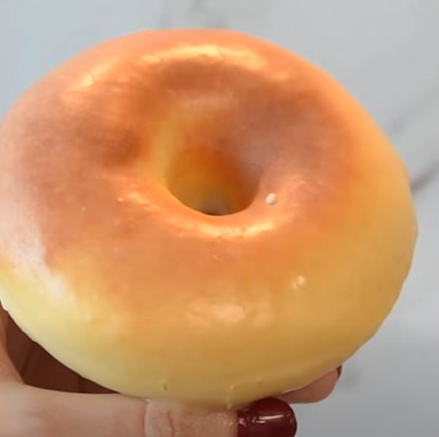

# Donuts 

Agrupamos varias recetas de donuts en esta página

## Receta 1: donuts de chocolate

    

### Datos básicos

* Comensales: 4
* Tiempo total de preparación: 1 hora
* [Receta en Facebook](https://www.facebook.com/reel/1604485297343502)

### Ingredientes

* 2 plátanos
* 2 huevos
* 50g de almendra molida
* 20g de cacao puro en polvo
* 1 cucharadita de levadura o bicarbonato
* 1 tableta de chocolate para fundir

### Preparación

1. En un bol añadir los platanos partidos, los huevos, la almendra, el cacao en polvo y la levadura. Triturarlo bien y poner en moldes de donuts
2. Llevar al horno a 180ºC durante 20 minutos
3. Cuando se enfríen, derretir el chocolate para fundir y echar por encima

## Receta 2: donuts glaseados

    

### Datos básicos

* Comensales: 4
* Tiempo total de preparación: 2 horas
* [Receta en Facebook](https://www.facebook.com/reel/2325854074818701)

### Ingredientes

* 300 g de harina de trigo
* 1 huevo
* 120 g de leche
* 40 g de mantequilla derretida
* 7 g de levadura seca
* 35 g de azúcar
* 1 pizca de sal

Para el glaseado:

* 250 g de azúcar glas
* 75 g de mantequilla
* 3 cucharadas de leche
* 1 cucharadita de extracto de vainilla

### Preparación

1. En un bol mezclar la harina, el azúcar y la sal. En otro recipiente mezclar el huevo, la leche, la mantequilla derretida y la levadura seca
2. Incorporar los ingredientes líquidos a los secos y mezclar hasta formar una masa
3. Engrasar una superficie de trabajo y amasar 10-15 minutos, hasta conseguir una masa suave y elástica
4. Colocar la masa en un bol engrasado. Tapar con papel film y dejar reposar 1 hora y media, hasta que aumente de tamaño.
5. Estirar la masa sobre una superficie enharinada hasta tener un grosor de unos 2 cm. Cortar los donuts utilizando un molde, taza y/o tapón.
6. Colocar los donuts sobre papel de horno y pintarlos con mantequilla derretida. Dejar reposar 30 minutos
7. Cocinar en airfryer u horno a 180ºC durante 3 minutos
8. Para el glaseado, mezclar el azúcar glas, la mantequilla, la leche y la vainilla hasta conseguir una crema suave.
9. Bañar los donuts en el glaseado y dejar reposar 10 minutos para que se asiente