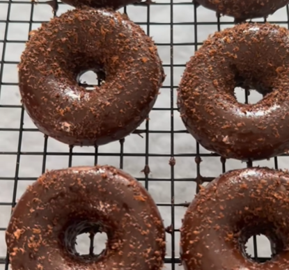

# Donuts de chocolate

    

## Datos básicos

* Comensales: 4
* Tiempo total de preparación: 1 hora
* [Receta en Facebook](https://www.facebook.com/reel/1604485297343502)

## Ingredientes

* 2 plátanos
* 2 huevos
* 50g de almendra molida
* 20g de cacao puro en polvo
* 1 cucharadita de levadura o bicarbonato
* 1 tableta de chocolate para fundir

## Preparación

1. En un bol añadir los platanos partidos, los huevos, la almendra, el cacao en polvo y la levadura. Triturarlo bien y poner en moldes de donuts
2. Llevar al horno a 180ºC durante 20 minutos
3. Cuando se enfríen, derretir el chocolate para fundir y echar por encima