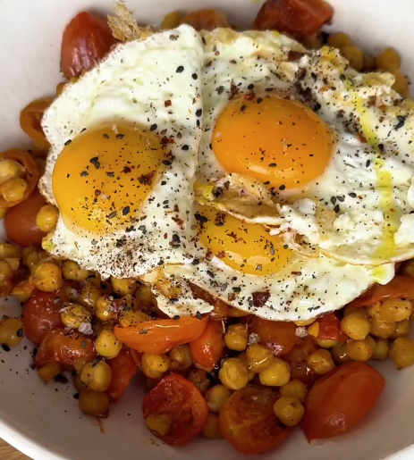

# Ensalada de garbanzos y huevo

    

## Datos básicos

* Comensales: 4
* Tiempo total de preparación: 30 minutos
* [Receta en Facebook](https://www.facebook.com/share/r/1HskHxftYc/)

## Ingredientes

* 2 botes de garbanzos cocidos (800 gramos en total)
* 200 gramos de tomates cherry en mitades
* 4 huevos
* Aceite de oliva
* Sal
* Especias al gusto (pimienta, pimentón, orégano, cúrcuma...)

## Preparación

1. Mezclar los garbanzos y los tomates con aceite, sal y especias
2. Hornear la mezcla durante 15 minutos a 200ºC aproximadamente (revisar para que no se tueste mucho)
3. Pasar a un plato y añadir un huevo a la plancha encima por comensal
