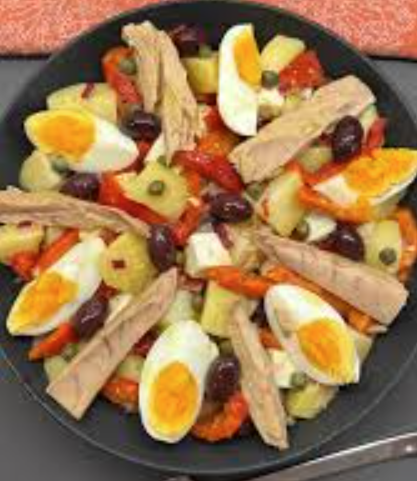

# Ensalada templada de patata y pimientos

    

## Datos básicos

* Comensales: 4
* Tiempo total de preparación: 1 hora

## Ingredientes

* 3 pimientos rojos
* 4 patatas
* 3 huevos duros
* 1 cebolla roja
* 1 bote de alcaparras
* 1 bote de olivas
* 2 botes de queso fresco
* 2-3 latas de ventresca de atún
* Aceite de oliva
* Vinagre (de manzana por ejemplo)
* Mostaza de Dijon
* Sal

## Preparación

1. Cocer las patatas con piel y pelarlas cuando estén listas
2. Mientras se cuecen las patatas, en una fuente de horno poner los pimientos con un chorro de aceite. Hornear 1 hora a 190º y darles la vuelta a mitad de horneado. Al terminar, dejar pelados y cortados en tiras finas, y reservar el jugo
3. En un bote mezclar aceite, vinagre, una cucharadita de mostaza, sal y el jugo de los pimientos. Emulsionar hasta que quede una mezcla homogénea.
4. Poner las patatas troceadas con los pimientos, la cebolla, olivas, alcaparras y el queso troceado, y regar con la vinagreta.
5. Añadir el atún y los huevos partidos en cuartos, y servir.