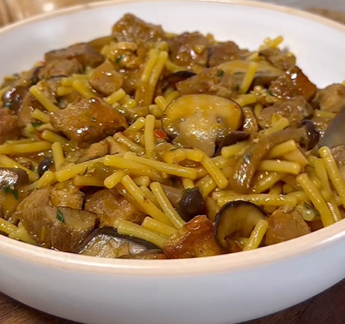

# Fideos con secreto y setas

    

## Datos básicos

* Comensales: 4
* Tiempo total de preparación: 1h 30 minutos
* [Enlace a receta en Facebook](https://www.facebook.com/reel/2282073669305799)

## Ingredientes

* 300 gramos de secreto de cerdo, cortado en tacos
* 200 gramos de setas variadas
* 200 gramos de fideo grueso
* 900 ml de caldo de carne o pollo
* 1 chorrito de vinagre de módena
* 1 cebolla mediana
* 1/2 pimiento verde
* 1/2 pimiento rojo
* 3 dientes de ajo
* 200 gramos de tomate rallado
* Aceite de oliva
* Sal y pimienta
* Perejil

## Preparación

1. Doramos el secreto troceado y salpimentado en una olla con aceite hasta que se dore. Reservamos
2. En la misma cazuela salteamos las setas con un poco más de aceite y una pizca de sal. Reservamos
3. Picamos la cebolla, el ajo y los pimientos y los rehogamos en la misma cazuela. Cuando estén tiernas y hayan cambiado de color agregamos el tomate rallado y sofreímos bien, 15-20 minutos a fuego bajo (agregar algo de agua si es necesario para que no se pegue)
4. Con el sofrito listo añadimos la carne reservada y las setas. Añadimos 100 ml de caldo de pollo y el chorro de vinagre de módena y reducimos un poco.
5. Vertemos el resto del caldo y hervimos a fuego suave con la olla tapada durante 40 minutos
6. Añadimos colorante alimentario o azafrán y los fideos. Cocinamos el tiempo que necesiten los fideos