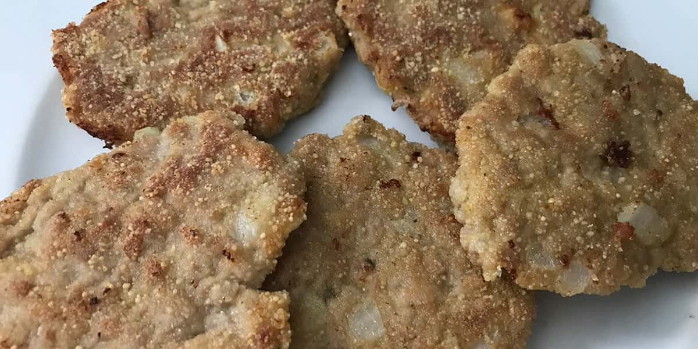

# Filetes rusos

    

## Datos básicos

* Comensales: 4
* Tiempo total de preparación: 30 minutos

## Ingredientes

* 1Kg de carne picada de ternera
* 2 dientes de ajo
* 2 huevos
* Perejil
* Sal
* Pimienta
* Pan rallado
* Aceite de oliva

## Preparación

* Añadir a un bol
    * La carne picada
    * Los dientes de ajo picados
    * Los huevos
    * Perejil
    * Un pellizco de sal y pimienta
    * Una cucharada grande de pan rallado
* Mezclar bien
* Hacer bolitas con la masa y aplastarlas
* Pasarlas por pan rallado o harina para rebozarlas
* Freír en abundante aceite
