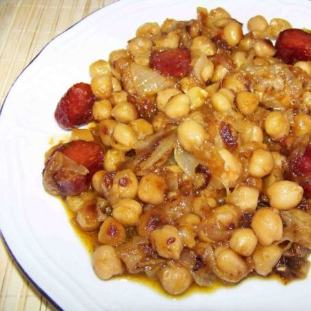

# Garbanzos a lo pobre

    

## Datos básicos

* Comensales: 4
* Tiempo total de preparación: 30 minutos

## Ingredientes

* 2 botes de garbanzos cocidos (800 gramos en total)
* 1 cebolla
* 2 ajos
* 2 packs de jamón a tacos
* 50-100 gramos de chorizo de guisar, troceado
* 1 pastilla de caldo de carne o de pollo
* 1 copa de vino blanco
* Pimienta
* Pimentón
* Aceite de oliva

## Preparación

1. Lavar y escurrir los garbanzos. Sofreírlos en una sartén con un poco de aceite, a fuego medio-suave
2. Mientras tanto, en una olla freír la cebolla picada y los ajos picados
3. Añadir a la olla el jamón y el chorizo, remover un poco y rehogar 2 minutos
4. Añadir el vino y la pastilla de caldo, el pimentón y la pimienta. Dejar 2 minutos
5. Añadir los garbanzos y dar vueltas hasta que se reduzca un poco