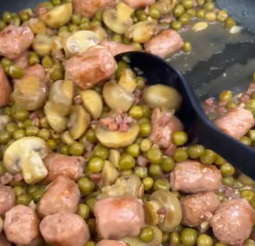

# Guisantes con salchichas y jamón

    

## Datos básicos

* Comensales: 4
* Tiempo total de preparación: 30 minutos
* [Receta en TikTok](https://www.tiktok.com/@mar_yyomismaymiscosas/video/7279725601785711905)

## Ingredientes

* 500g de longaniza fresca
* 3 botes pequeños de guisantes en conserva
* 2 botes de champiñones en conserva
* 200g de jamón en tacos
* 3 dientes de ajo
* 300 ml de agua
* 1 pastilla de caldo de carne o de pollo
* 1 chorro de vinagre de módena
* Aceite de oliva
* Sal y pimienta

## Preparación

1. Sofreír los dientes de ajo picado con un poco de aceite
2. Cuando empiecen a dorarse añadir la longaniza cortada en trozos
3. Cuando la longaniza empiece a dorarse añadir los champiñones y cocinar 5 minutos
4. Añadir 200 ml de agua con la pastilla de caldo, y el chorro de vinagre. Cocinar 2 minutos 
5. Añadir 100 ml más de agua. Añadir sal y pimienta y cocinar 8 minutos
6. Añadir los guisantes y el jamón y cocinar otros 7 minutos más