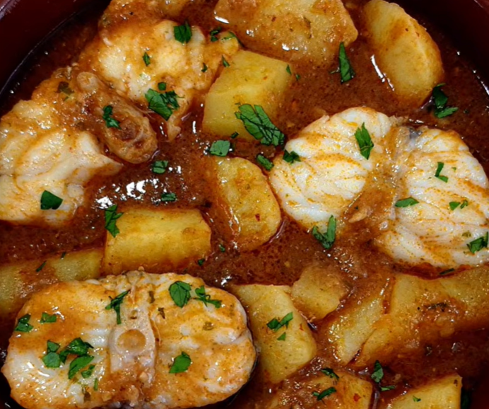

# Guiso de rape

    

## Datos básicos

* Comensales: 4
* Tiempo total de preparación: 45 minutos
* [Receta en YouTube](https://www.youtube.com/watch?v=V6WVcc0OGGQ)

## Ingredientes

* 2 colas de rape (o 1 si es muy grande)
* 500 ml de fumet o caldo de pescado
* 2 patatas
* Aceite de oliva
* Perejil
* Sal
* Pimienta
* 2 rebanadas de pan
* 5 dientes de ajo
* 1 cucharada de pulpa de pimiento choricero

## Preparación

1. Añadimos aceite en una sartén y sofreímos los ajos laminados y las rebanadas de pan por los dos lados
2. Cuando esté listo lo llevamos a un mortero (troceamos un poco el pan). Añadimos perejil y machacamos bien. Cuando esté bien machacado añadimos la cucharada de pulpa de pimiento choricero y mezclamos bien. Reservamos
3. Cortamos las colas de rape en rodajas o trozos grandes, los salpimentamos y los llevamos a una sartén con aceite. Doramos los trozos y reservamos
4. Pelamos y partimos las patatas en trozos chascados. Las añadimos a la sartén donde estaba el rape, con algo de sal y rehogamos un poco. 
5. Añadimos el caldo de pescado o fumet y la mezcla del mortero. Cuando rompa a hervir, tapamos y dejamos hasta que las patatas estén tiernas.
6. Añadimos el rape y cocinamos 4-5 minutos más.
7. Podemos decorar con algunas hojas de perejil por encima al emplatar