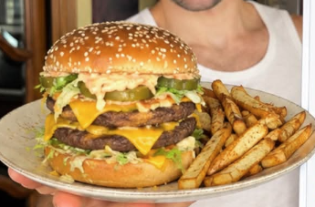

# Hamburguesa estilo Big Mac

    

## Datos básicos

* Comensales: 4
* Tiempo total de preparación: 30 minutos

## Ingredientes

* 150 g de carne picada magra de ternera por persona (600 g en total)
* 1 pan brioche de hamburguesa por persona
* Queso en lonchas (preferible queso ahumado light si es posible)
* Lechuga iceberg
* 1 cebolla
* 2-3 pepinillos agridulces
* Sal, pimienta y ajo en polvo
* 2-3 patatas
* Aceite de oliva en spray
* Salsa Big Mac
    * 30 g de yogur griego 0%
    * 10 g de ketchup sin azúcar
    * 2 g de mostaza americana suave
    * Un chorrito de zumo de pepinillos

## Preparación

* Por persona, formar dos hamburguesas de unos 70-75 g y aplastarlas. Cocinarlas en una sartén o plancha caliente (sin aceite, o con una gota apenas) 1-2 minutos por lado. 
* Tostar el pan (por un lado solo, si se prefiere)
* Montar el pan, salsa, lechuga, pepinillos, cebolla, hamburguesa, queso, segunda hamburguesa, queso y más salsa (o en el orden que se quiera)
* Para la salsa Big Mac, mezclar bien todos los ingredientes indicados y reservar
* Para las patatas: cortarlas en bastones, echar sal, pimienta, ajo en polvo o las especias que queramos. Un chorro de spray en aceite y a la freidora de aire