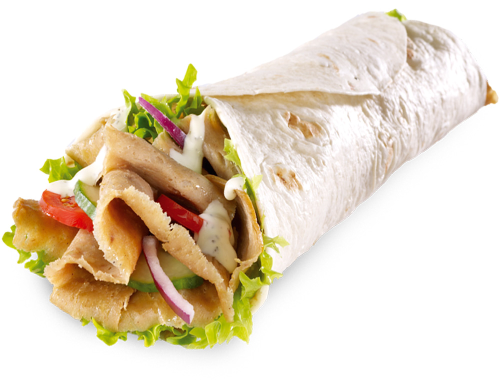
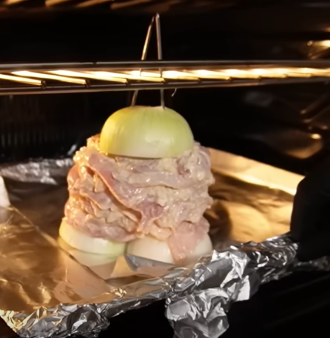
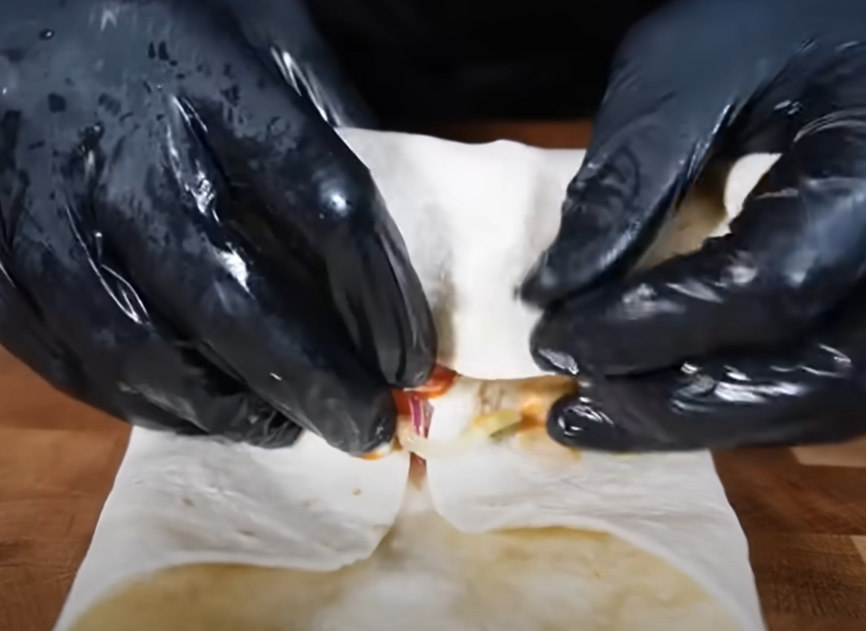

# Kebab casero

    

## Datos básicos

* Comensales: 4
* Tiempo total de preparación: 3-4 horas

## Ingredientes

**Verduras:**

* 1 - 2 tomates
* 2 cebollas blancas
* 1-2 cebollas rojas
* 1 zanahoria (opcional)
* 1 ajo entero
* 1 lechuga Iceberg
* Cebollino
* 1 Limón

**Carne:**

* 1 kg de contramuslos de pollo deshuesados y sin piel

**Salsas, especias y condimentos:**

* 1 bote grande de yogur griego
* Tomate frito
* Ketchup
* Mayonesa
* Agua con gas
* Vinagre de manzana
* Vinagre de Módena
* Aceite de oliva
* Sal
* Pimienta
* Jengibre en polvo
* Curry en polvo
* Canela
* Cúrcuma 
* Orégano
* Cilantro (mejor fresco)
* Salsa de soja

## Preparación

### Maceración de la carne

* Añadimos a un bol: 
    * 3 cucharadas grandes de yogur griego 
    * Zumo de medio limón
    * 1 cucharada de aceite de oliva
    * Un poco de sal, pimienta, jengibre en polvo, curry, canela, cúrcuma
    * 2 dientes de ajo rallados
* Cubrimos los contramuslos con film transparente y los aplastamos con algo (por ejemplo, un rodillo)
* Partimos por la mitad los contramuslos y los metemos en el marinado, tapamos con film y lo guardamos durante al menos 3 horas en la nevera.

### Salsa blanca

Mezclar:

* 2 partes de yogur griego
* 1 parte de mayonesa
* Un poco de orégano
* Cilantro (mejor fresco picado)
* 2 dientes de ajo rallados
* 1 poco de salsa de soja

### Salsa roja

Mezclar:

* 2 partes de tomate frito
* 1 parte de ketchup
* Sal, pimienta y azúcar
* Cebollino picado

### Horneado de la carne

* Partimos las dos cebollas blancas sin quitar los pedúnculos
* Ensartamos dos brochetas (metálicas) cada una en media cebolla
* Vamos colocando los contramuslos marinados sobre las dos brochetas
* Tapamos encima con otra media cebolla que una las dos brochetas

    

* Metemos al horno a 190º durante 30-40 minutos

### Marinado de la cebolla

* Cortamos en juliana fina la cebolla roja
* Añadimos a un bol:
    * Vinagre de manzana
    * Aceite de oliva
    * Un poco de vinagre de Módena
    * Agua con gas
    * 2 cucharaditas de sal
    * 2 cucharaditas de azúcar
* Metemos la cebolla bien sumergida, y reservamos mientras se haga el pollo

### Preparación de los rollos

* Cortamos fino y picamos el pollo
* En cada torta añadimos:
    * Lechuga
    * Tomate en rodajas
    * Cebolla roja
    * Un poco de zanahoria rallada (opcional)
    * Salsas roja y blanca
* Enrollamos

    

* Cubrimos con papel de aluminio y tostamos en sartén sin aceite 