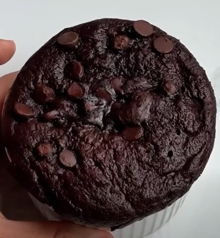
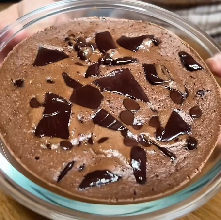

# Mini pastel de chocolate

## Versión 1

    

### Datos básicos

* Comensales: 1
* Tiempo total de preparación: 10 minutos
* [Receta en Facebook](https://www.facebook.com/reel/1458180622154063)

### Ingredientes

* 1 plátano
* 1 huevos
* 1 cucharadita de cacao puro
* 1/2 cucharadita de levadura
* 1/2 taza de leche (taza de café, pequeña)
* 1 cucharadita de sirope de arce o caramelo, para endulzar
* Pepitas de chocolate

### Preparación

1. En un bol pequeño apto para microondas triturar el plátano, añadir el huevo, el cacao, la levadura, la leche y el sirope. Remover bien hasta tener una masa homogénea
2. Añadir pepitas de chocolate por encima
3. Llevar al microondas 1 minuto y medio

## Versión 2

    

### Datos básicos

* Comensales: 1
* Tiempo total de preparación: 10 minutos
* [Receta en Facebook](https://www.facebook.com/reel/801742582974495)

### Ingredientes

* 1 plátano
* 2 huevos
* 1/2 vaso de leche
* 60 g de avena molida
* 2 cucharadas de cacao en polvo
* Pepitas de chocolate

### Preparación

1. En un bol pequeño apto para microondas triturar el plátano, añadir los huevos, la avena, la leche y el cacao y mezclar hasta obtener una pasta
2. Añadir pepitas de chocolate por encima
3. Llevar al microondas 4 minutos