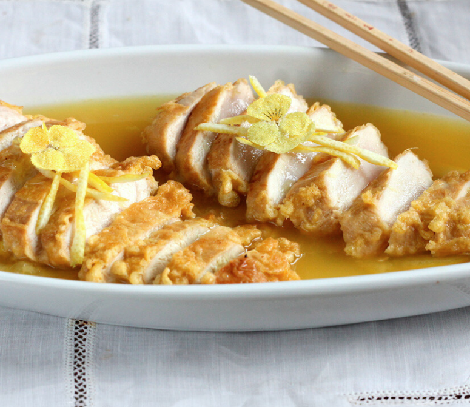

# Pollo al limón estilo chino

    

## Datos básicos

* Comensales: 4
* Tiempo total de preparación: 45 minutos

## Ingredientes

* 2-3 filetes de pechugas de pollo por persona
* 150 ml de caldo de pollo
* Salsa de soja
* 2 limones
* 2 cucharadas de maizena
* 2 cucharadas de azúcar
* 2 huevos

## Preparación

1. Exprimimos los limones. En un cazo ponemos a cocer el zumo junto con el azúcar, el caldo de pollo y una cucharada de maizena, a fuego lento hasta que espese
2. Marinamos en salsa de soja las pechugas durante 30 minutos
3. Mezclamos la otra cucharada de maizena con los huevos batidos, y con esa mezcla empanamos las pechugas escurridas y las freímos hasta que se doren
4. Cortamos las pechugas en tiras y echamos la salsa por encima