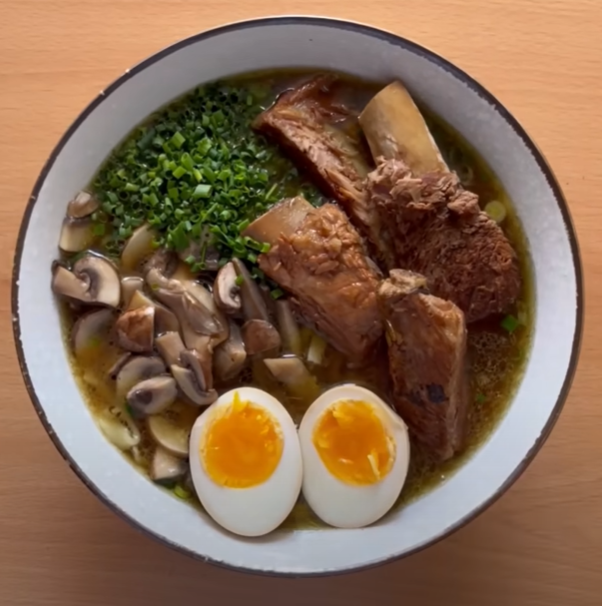

# Ramen

    

## Datos básicos

* Comensales: 4
* Tiempo total de preparación: 3 horas

## Ingredientes

* 1 Kg de costillas de cerdo
* 2 cebollas
* 1 cabeza de ajos
* 2 zanahorias
* 6 ajos tiernos
* 240 ml de salsa de soja
* Jengibre
* Champiñones/Setas
* Cebollino
* 4 huevos
* Azúcar
* Sal
* 2,5 litros de agua

## Preparación

1. Hervir las costillas 5 minutos a fuego fuerte. Enjuagarlas en agua fría después y reservar.
2. Preparamos la base del caldo: las 2 cebollas cortadas en cuartos, las dos zanahorias, 3 ajos tiernos, 8 dientes de ajo y 50g de jengibre en láminas. En una olla echamos una buena cantidad de aceite y doramos las verduras. Cuando estén doradas añadimos las costillas, 2 litros y medio de agua y 120 ml de salsa de soja. Hervir 2 horas con tapa puesta a fuego medio, y remover de vez en cuando.
3. Preparamos los huevos: ponemos agua a hervir, y cuando hierva echamos los 4 huevos durante 6 minutos y medio. Luego los ponemos a remojo con agua con hielo, o los remojamos varias veces en agua fría. Los pelamos cuando estén fríos, y los dejamos a remojo con agua, salsa de soja (100-120ml) y un poco de azúcar, hasta que todo lo demás esté listo.
4. Preparamos ahora los toppings:
    * 3 ajos tiernos troceados, 3 dientes de ajo rallados y un poco de jengibre pelado y rallado. Lo ponemos en un cuenco pequeño y le echamos por encima unos 60ml de aceite de oliva muy, muy caliente. Reservamos 
    * Salteamos unos cuantos champiñones/setas al gusto y reservamos
    * Troceamos fino un poco de cebollino
5. Cuando el caldo esté listo, sacamos las costillas y las ponemos en una sartén junto con el líquido del marinado de los huevos y una cucharada sopera de azúcar para compensar el sabor y caramelizar la salsa. Cuando la salsa se haya reducido bastante, ya están listas las costillas. Reservamos
6. Cocemos la pasta de ramen (mirar tiempo según la pasta). Al finalizar, pasar la pasta por agua fría para parar la cocción
7. Emplatamos:
    * Abajo ponemos el topping de ajos tiernos
    * Luego unos 2-3 cazos de caldo
    * Luego la pasta cocida (removemos con el caldo para mezclar y que se vuelva a calentar la pasta con el caldo)
    * Ponemos los toppings de setas/champis en un cuarto de la parte superior
    * El cebollino en otro cuarto
    * 3-4 costillas en otro cuarto
    * Un huevo partido por la mitad en otro cuarto

