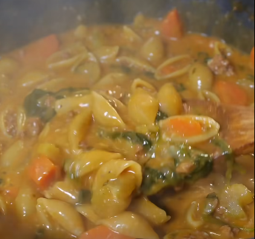

# Sopa de pasta

    

## Datos básicos

* Comensales: 4
* Tiempo total de preparación: 1 hora
* [Enlace a receta en Facebook](https://www.facebook.com/reel/1246841567560577)

## Ingredientes

* 500g de carne picada de ternera
* 400g de caracolas de pasta
* 2 zanahorias
* 4 ramas de apio
* 1 cebolla
* 1 diente de ajo
* 50-100g de espinacas
* 100ml de leche de coco
* Parmesano rallado
* 1 cucharadita de tomate concentrado
* 1 cucharadita de ajo en polvo
* 1 cucharadita de pimentón
* 1 cucharadita de hierbas provenzales
* 1 cucharada de maizena/tapioca
* Sal y pimienta
* 1,2 litros (aprox) de caldo de pollo

## Preparación

1. Cortar la verdura fina (zanahorias, apio y cebolla) y añadirla en una olla con aceite, un diente de ajo troceado, pimienta y sal
2. Cuando dore añadimos la carne picada con un poco más de sal y pimentón
3. Cuando esté hecha añadimos el tomate concentrado y la maicena/tapioca
4. Añadimos el caldo de pollo, la leche de coco y hierbas provenzales
5. Dejar espesar un poco el caldo y añadir la pasta
6. Cuando la pasta esté hecha, añadir las espinacas para que se hagan un poco con el caldo caliente.