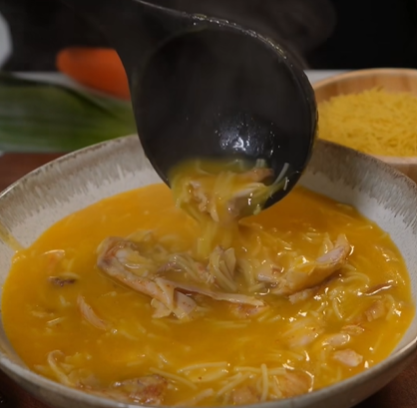

# Sopa de pollo

    

## Datos básicos

* Comensales: 4
* Tiempo total de preparación: 1h 30 minutos
* [Enlace a receta en Facebook](https://www.facebook.com/reel/1912765436334699)

## Ingredientes

* 1 pollo entero cortado en trozos, y sin piel
* 200 gramos de fideos
* 1 cebolla
* 1 zanahoria
* 1 puerro
* 3 dientes de ajo
* 1 trozo de jengibre
* 1 hoja de laurel
* 1 cucharadita de pimentón
* 1 cucharadita de sal
* 3 bolitas de pimienta negra
* Perejil fresco

## Preparación

1. Poner el pollo en una cacerola grande con las verduras troceadas (trozos grandes), el jengibre, los ajos, el laurel, el pimentón, la sal y la pimienta
2. Cubrir con agua, tapar y dejar hervir 1 hora
3. Retirar las verduras y batirlas
4. Retirar el pollo y desmenuzarlo
5. En la cazuela con el caldo añadir las verduras batidas, el pollo desmenuzado y los fideos. Cocer el tiempo que necesiten los fideos