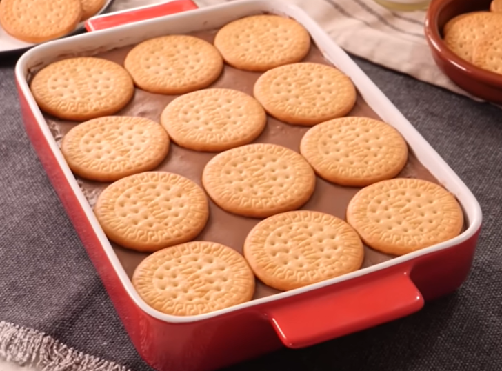

# Tarta de la abuela

    

## Datos básicos

* Comensales: 8-10
* Tiempo total de preparación: 30 minutos
* [Receta en YouTube](https://www.youtube.com/watch?v=ngYig0EF934)

## Ingredientes

* 1 paquete de galletas María (también sirven galletas rectangulares)
* 300 g de chocolate negro, con leche o mezcla (al gusto)
* 80 g de maicena
* 1,25 litros de leche

## Preparación

1. Trocear el chocolate en trozos pequeños para que se derrita mejor
2. Mezclar en un bol la maicena con 250 ml de leche
3. En una olla a fuego medio añadimos el litro de leche restante y el chocolate troceado. Dejamos que el chocolate se vaya derritiendo y mezclando con la leche. Mover para evitar que se pegue
4. Pasados unos segundos, con el chocolate integrado, añadimos la mezcla de leche y maicena y removemos constantemente hasta que espese y se convierta en crema
5. En una bandeja de horno, poner una base de chocolate (extender bien), y colocar encima una capa de galletas. Repetir el proceso hasta agotar el chocolate.
6. Dejar cuajar en el frigorífico al menos 8 horas