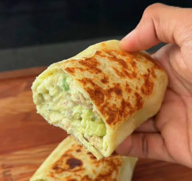

# Croquetas de bonito

    

## Datos básicos

* Comensales: 1
* Tiempo total de preparación: 10 minutos
* [Receta en Facebook](https://www.facebook.com/reel/1084411287285718)

## Ingredientes (por persona)

* 2 tortillas de trigo de 36 g
* 1 lata de atún al natural
* Cebolla picada (al gusto)
* Pimiento (al gusto)
* 1 aguacate aplastado/triturado
* 2 cucharadas de yogur natural, queso fresco batido o yogur griego light
* 1 cucharadita de mostaza cero
* Sal, pimienta y ajo en polvo
* Cilantro

## Preparación

* Mezclar bien todos los ingredientes (menos las tortillas de trigo)
* Rellenar las tortillas con ellos, sellarlas bien y tostarlas en una sartén sin aceite (o en la airfryer u horno)