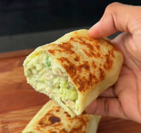

# Croquetas de bonito

    

## Datos básicos

* Comensales: 4
* Tiempo total de preparación: 10 minutos
* [Receta original en Facebook](https://www.facebook.com/reel/1084411287285718)

## Ingredientes (por persona)

*Versión adaptada respecto a la receta original*

* 2-3 tortillas de trigo de 36 g por persona
* 4 latas de atún al natural
* 1 Cebolla picada
* Zanahoria rallada
* 1 aguacate picado
* 7-8 cucharadas de yogur natural, queso fresco batido o yogur griego light
* 2 cucharadas de mayonesa
* 2 cucharadas de mostaza
* Sal, pimienta y ajo en polvo
* Cebollino

## Preparación

* Mezclar bien todos los ingredientes (menos las tortillas de trigo)
* Rellenar las tortillas con ellos, sellarlas bien y tostarlas en una sartén sin aceite (o en la airfryer u horno)