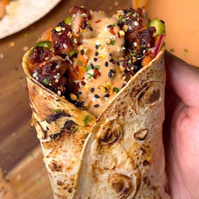

# Wraps de pollo BBQ

    

## Datos básicos

* Comensales: 4
* Tiempo total de preparación: 2 horas
* [Receta en Facebook](https://www.facebook.com/reel/2376385656101572)

## Ingredientes (por persona)

* 1500 g de contramuslos de pollo deshuesados y sin piel
* 10 tortillas de trigo o similar
* 2 cucharadas de sal, ajo en polvo, pimienta, cebolla en polvo y pasta de pimiento choricero para marinar la carne
* 2 cucharadas de semillas de sésamo
* 1 cucharada más de pasta de pimiento choricero
* 3 ajos rallados
* Zanahoria rallada
* 1 cebolla roja
* 1 pepino en rodajas
* 200 g de yogur bajo en grasa (griego light, por ejemplo)
* 120 g de mayonesa ligera
* Miel
* Salsa de soja
* Vinagre de arroz
* Salsa de chili dulce
* Leche

## Preparación

* Poner en una bandeja de horno los contramuslos y echar por encima las especias para marinar, el sésamo y el ajo rallado, junto con un chorro de miel y otro de salsa de soja. Mezclar todo bien y reservar unos 30 minutos.
* En un bol mezclar la zanahoria, cebolla roja, pepino y echar un chorro de vinagre de arroz y chili dulce. Mezclar bien
* Preparar la salsa: mezclar el yogur, la mayonesa, la cucharada de pimiento choricero, otro chorro de miel, ajo en polvo y algo de leche.
* Rociar aceite en spray sobre la carne y hornear 25-30 minutos a 200ºC
* Tostar las tortillas por una cara ligeramente
* Preparar los wraps: en cada tortilla echar un poco de ensalada de zanahoria, pollo cortado en rodajas/tiras y la salsa. 
